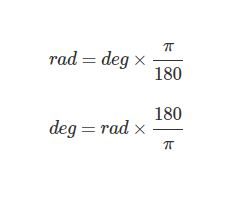

# JS30-Day08 Fun Canvas with HTML5

來到JS30的第八天，這次讓我們做出一個可以繪圖的網頁吧。

## 開始之前

### <kbd>HTML5</kbd> canvas

這是在HTML5新增，一開始只有在蘋果macOS上的Safari專有技術，之後才加入在HTML裡的技術，他能在頁面上顯示出一個點陣畫布區域，再搭配Javascript等等讓他運作、繪畫。

而canvas的基本運作方式是:

```html
<canvas id='draw' width='200px' height='200px'>
    你可以在這邊打字<br>
    若瀏覽器不支援HTML5的時候這邊會顯示出來
</canvas>
```

若要使用他，我們可以在Javascript上召喚:

```javascript
const canvas = document.querySelector('#draw');
```

單單這樣是不夠的，我們還要輸入`getContext()`，讓這個畫布渲染成可以繪製的2D/3D畫布。

這個範例要給他2D畫布，就可以這樣輸入:

```javascript
const draw = canvas.getContext('2d');
```

簡單運作一下，例如我們要在這個正方形範圍畫個對角線，就使用:

```javascript
draw.moveTo(0, 0);      //線的起點
draw.lineTo(200, 200);  //線的終點
draw.stroke();          //使其畫上
```

## 解題步驟

### 1. 在HTML當中新增一個 canvas

這邊我們試著"整個畫面，都是我的畫布"，也就是我們會使用`100vw`和`100vh`，所以直接在HTML裡面新增:

```html
 <canvas id="draw" width="100vw" height="100vh"></canvas>
```

### 2. 在Javascript中連結

我們先用`querySelector`找到`canvas`，並設定畫布大小為整個視窗，以利接下來的判定等:

```javascript
const canvas = document.querySelector('#draw');
canvas.width = window.innerWidth;
canvas.height = window.innerHeight;
```

然後，設定畫布為2D平面繪圖，順手給線條設定:

```javascript
const ctx = canvas.getContext('2d');

ctx.strokeStyle = '#00A8E8';  //線條顏色
ctx.lineJoin = 'round'; //兩線相交時的邊角外型
ctx.lineCap = 'round'; //線條尾端外型
ctx.lineWidth = 1; //線條寬度
```

### 3. 設定滑鼠監聽事件

既然是要讓滑鼠當畫筆，那麼要知道："當滑鼠按下時，移動進行繪圖；當滑鼠放開時，則不畫圖"這件事情。

既然如此我們可以搭配監聽事件去檢測，再看看剛剛那一句："當滑鼠按下(`mousedown`)時，移動(`mousemove`)進行繪圖；當滑鼠放開(`mouseup`)時，則不畫圖"，還要設定滑鼠出框也停止畫圖(`mouseout`)，那就先設定起來:

```javascript
canvas.addEventListener('mousedown',__________);
canvas.addEventListener('mousemove',__________);
canvas.addEventListener('mouseup',__________);
canvas.addEventListener('mouseout',__________);
```

接著設定兩個東西，一個是**畫圖判定**，而另一個是**畫圖的樣式**。

```javascript
//判定是否正在畫圖，預設當然是沒有啦
const isDrawing = false;

//當我繪圖時的含式
function draw(e){
    //當 isDrawing 為flase時直接回傳跳出函式
    if(!isDrawing){return;}
}
```

既然稍早有說滑鼠出框、放開時式不會畫圖的，那麼監聽事件中，`mouseup`和`mouseout`後面的值就可以:

```javascript
canvas.addEventListener('mouseup', () => isDrawing = false );
canvas.addEventListener('mouseout', () => isDrawing = false );
```

### 4. 設定繪圖的定義

那我們可以搭配上面所說繪製線條的方法，定義在`draw()`當中:

```javascript
// 先給兩個變數值，抓滑鼠座標
let lastX = 0;
let lastY = 0;

function draw(e){
  if (!isDrawing) return;

  //定義畫圖
  ctx.beginPath(); //開始繪圖
  ctx.moveTo(lastX, lastY); //線條起點
  ctx.lineTo(e.offsetX, e.offsetY); //線條終點
  ctx.stroke(); //線條繪出

  [lastX,lastY] = [w.offsetX,w.offsetY]; //更新滑鼠位置
}
```

其中，`offsetX`和`offsetY`是滑鼠的目前座標。

回到監聽事件，設定`mousedown`的`isDrawing`為真，並且給他滑鼠座標:

```javascript
canvas.addEventListener('mousedown', (e)=> {
  isDrawing = true; //轉成true開始繪圖
  [lastX, lastY] = [e.offsetX, e.offsetY]; //滑鼠位置
});
```

那麼當我滑鼠移動時，就可以直接加入`draw`函式，當我滑鼠按下又移動時就可以繪出線條來:

```javascript
canvas.addEventListener('mousemove',draw);
```

至此基本繪圖就可以了，現在可以打開來看看是不是成功的。

### 5. 設定顏色與寬度隨之變化

接下來我們要做的事情是
1. 線條變色有如彩虹
2. 寬度從細變粗，再由粗變細的輪迴

先設定顏色部分，我們可以使用HSL，他是RGB的圓柱座標的表示，分別代表:
* 色相(H)，色彩的基本屬性，就是顏色名稱
* 飽和度(S)，從0~100%(灰暗~濃純)
* 亮度(L)，也可以改明度(V)，從0~100%(暗到亮)

這邊注意的是，亮度越大越白，而明度越大只是越靠近設定原色。

回到題目，顏色的部分直接去動色相就可以了，那我們就在外面先準備:

```javascript
let hue = 0;
```

然後我們可以在`draw`函式裡面設定:

```javascript
// 設定線條顏色，而色相向外去設定
ctx.strokeStyle = ` hsl( ${hue}, 100%, 50%) `;
// 每次進來這個迴圈，色相就增加1
hue++;
// 當色相到360時，歸零重計
if(hue >= 360){hue = 0;}
```

那線條呢？我們可以一樣先設定direction，這個是要判定寬度讓我們可以知道是要逐漸變出還是變細:

```javascript
let direction = true;   // 預設從1開始就先給true
```

接著在`draw`中，我們給他最粗就到30px，那麼:

```javascript
// 當寬度大於等於30時，將direction轉false
if(ctx.lineWidth >= 30 || ctx.lineWidth <= 1){
    direction = !direction ;
}
if(direction){
    //當direction為true，增加寬度
    ctx.lineWidth++;
}else{
    //當direction為false，減少寬度
    ctx.lineWidth--;
}
```

最後再打開看看應該就完成了。

## 補充資料

### <kbd>HTML5</kbd> canvas的更多用法

這個例子當中使用線的方式繪圖，當然也能使用繪製各種圖形，這邊就簡單說明矩形和圓形的繪製方法。

還有更多說明可以看[這邊](https://developer.mozilla.org/zh-TW/docs/Web/API/Canvas_API/Tutorial/Drawing_shapes)。

#### 矩形

```javascript
draw.fillStyle='blue';
draw.fillRect(X座標, Y座標, 寬, 高);
```

* fillstyle設定顏色。
* fillRect是設定形狀。X座標左負右正，Y座標上負下正。

#### 圓形

開始畫圓之前，我們可以給他個指令開始繪製路徑:

```javascript
draw.beginPath();
```

先別這麼快問為什麼用`beginPath()`，待會來說。

接下來要畫圓囉，會稍微複雜:

```javascript
draw.arc( 圓心X座標, 圓心Y座標, 半徑, 起始角度, 結束角度);
draw.stroke();
```

`arc()`內包含的數據有:
* 圓心X座標左負右正，圓心Y座標上負下正。
* 半徑單位為px。
* 起始角度與結束角度以弧度計算。

其中座神秘的就是角度了，角度預設是弧度(radian)，他的換算公式是:



所以當我要給他一個完整個圓(劃一個360度的弧線)，那我們可以給他2倍的π，使用π就要用`Math.PI`，那麼結果就是`2*Math.PI`。

### <kbd>HTML5</kbd> canvas.globalCompositeOperation

這個是在canvas一個功能，是指畫布中和成的效果。

這個例子中作者提過可以使用'multiply'，代表顏色疊加效果，當然有更多的效果，可以直接看[W3School](https://www.w3schools.com/tags/canvas_globalcompositeoperation.asp)和[MDN](https://developer.mozilla.org/zh-TW/docs/Web/API/Canvas_API/Tutorial/Compositing)的說明。
